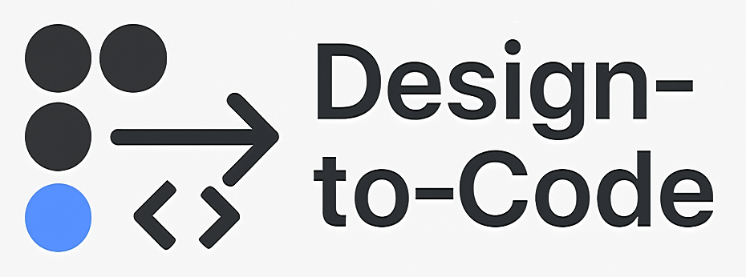
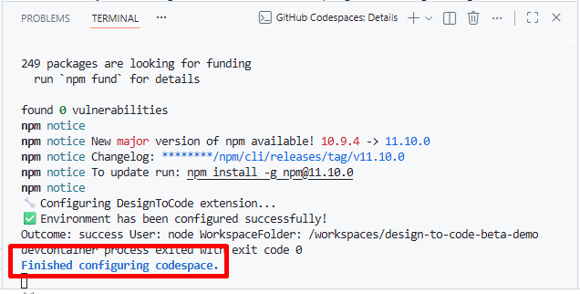

<div align="center">
    
</div>

# Design-to-Code Beta Demo

## Tool Introduction

Design-to-Code (DtC) is a specialized tool for software engineering teams that bridges the gap between frontend design and development. DtC automates the conversion of Figma designs, both individual components and full pages, into production-ready Angular components, responsive pages, and Storybook stories. It reduces manual implementation effort while accelerating development and ensuring design consistency and high quality.

## How it works

DtC is delivered as a VS Code extension and a Figma plugin, designed to integrate smoothly into existing workflows without interrupting software engineering teams’ processes. Via a simple configuration file, called `design-to-code.json, that maps existing Figma designs to actual Angular components, engineers can start converting designs into code directly via VS Code.

The conversion is handled externally via the DtC API, receiving only the minimal component or page description extracted from Figma. All Figma access and data handling occur locally on the engineer’s machine for privacy and security of design assets.

## Advantages

- **Design System Enforcement**: Ensures the implemented components remain visually and behaviorally consistent with their Figma definitions.
- **Predictable, Standardized Codebase**: Every component follows consistent conventions and best practices.
- **Reusable Components**: Build once, reuse everywhere, enabling scalability and maintainability.
- **Fast Implementation**: Up to 70% reduction in design-to-code effort of design components implementation, accelerating delivery cycles.
- **Low Cognitive Load, QA-Focused**: Engineers spend less time on repetitive code allowing them to focus more on refinement and quality assurance.
- **Accessibility Improvement**: Enforce or suggest WCAG 2.1 AA fixes after generation to ship accessible components and pages without sacrificing visual fidelity.

## Codebase

This repository contains a preconfigured Angular v21 project with the `design-to-code.json` file already set up and linked to an actual [Figma project](https://www.figma.com/design/LMq8z4SVGHzRIiTZ9uHbt1/DTC-Playground-Beta)\*. It also includes several components that have already been generated using DtC.

In addition, the `design-to-code.json` file references some components and a page that are not yet part of the codebase. These are intentionally left for you to generate in order to better understand how DtC works.

To test DtC, create a new GitHub Codespace by clicking the `Code` dropdown, navigating to the `Codespaces` tab, and selecting **Create codespace on main**. This will launch a fully functional VS Code environment preloaded with both the Angular project and the DtC extension.

To monitor the set up process make sure to click on the **Building codespace** link on the toast at the bottom-right corner.

<div align="center">
    
</div>

You will know when the environment is setup (usually takes 2-3 minutes) when you see the following:

<div align="center">
    
</div>

Then, open a new terminal inside VS Code and run:

```
npm run start
```

A new browser tab will open, where you can view the components already implemented by DtC. Be sure to review the original designs in Figma as well.

> **Note:** In some cases, the Codespace may fail to initialize due to a GitHub Codespaces bug (check image below). If this happens, please delete the Codespace and start it again.


\* When accessing the Figma project, you will be prompted to enter this password: `Nkdj$ek*kdj`. 

### Using DtC

Now that your Codespace is up and running, you can use DtC to generate the remaining components. These components fall into three categories:

1. **Atomic components**: Stand-alone components that do not rely on any other components (as defined in Figma).
2. **Complex components**: Components composed of other components. To generate one of these, the individual components it depends on must be created first.
3. **Pages**: High-level components that serve as actual application pages that will be registered in the routing configuration.

To generate an atomic component, such as `icon-only-button` or `basic-input`, open the Command Palette using `Ctrl + Shift + P` and select `DTC: Generate Component`. You will be presented with a list of all components defined in the `design-to-code.json` file. After selecting the desired component, the generation process will begin, and shortly afterward, the component will appear in your codebase.

The same process applies to complex components, such as `confirmation-modal`, provided their dependent components have already been generated.

To showcase a generated component, open its `.ts` file (the file containing the component definition) and run `DTC: Showcase Component`. This will add component variations to the `/showcase` route for review.

To generate a page, such as `waiting-list`, run the `DTC: Generate Page` command. Once the page has been created, open its `.ts` file and execute `DTC: Showcase Page`. This will register a new route for the page. To review it, navigate to the `/waiting-list` route in your browser.

## Next Steps

This guide provides just a brief overview of DtC. To get the full experience, check out the [learning material](https://dtc-api-beta.fromscratch-projects.com/learn/), which includes detailed instructions on setting it up in your projects, generating Storybook stories, making your code accessible, and much more through both documentation and videos.
